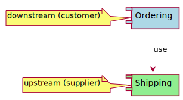
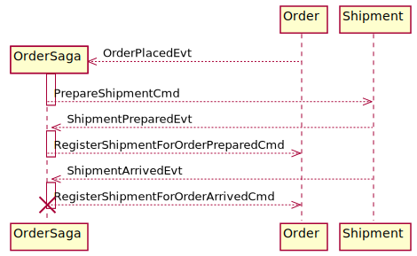
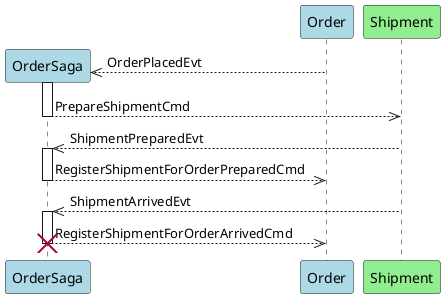

# Order Demo - Bounded Contexts with Axon

> This demo was inspired by the [blog post](https://axoniq.io/blog-overview/bounded-contexts-with-axon) which is published on [axoniq.io](https://axoniq.io/)

<table>
    <tr>
        <td><strong>Domain:</strong></td>
        <td>Order Management - Demo</td>
    </tr>
    <tr>
        <td><strong>Concepts:</strong></td>
        <td>Domain Driven Design (Subdomains, Bounded Contexts, Ubiquitous Language, Aggregates, Value Objects)</td>
    </tr>
    <tr>
        <td><strong>Architecture style:</strong></td>
        <td>Event Driven Microservices</td>
    </tr>
    <tr>
        <td><strong>Architectural patterns:</strong></td>
        <td>Eventsourcing, CQRS</td>
    </tr>
    <tr>
        <td><strong>Technology:</strong></td>
        <td>Java, <strong>Axon (AxonFramework,  AxonServer CE)</strong>, Spring (Boot), SQL</td>
    </tr>
</table>

## Domain

Customers use the website application(s) to place orders. Application coordinates order preparation and shipping.

## Sub-domains

- **Order** management
  - Order taking and fulfillment management
- **Shipping** management
  - Managing shipping/delivery of the order.

The `Order` (`Shipping`) objects ([aggregates](https://martinfowler.com/bliki/DDD_Aggregate.html)) in each sub-domain model represent different term of the same 'Order' business concept.

- The Shipping sub-domain has a different view of an Order (Shipment). Its version of an Order could simply consist of a status and a address, which can tell courier how and where to deliver the order.  

We must maintain consistency between these different 'orders' in different sub-domains.

> Typically, we can split complex domain into sub-domains, where each sub-domain corresponds to different part of the business.
> Identifying sub-domains requires understanding of the business, mostly its organizational structure and areas of expertise.

## Domain model

Sub-domain *software programing* models:

 - [ordering](ordering)
 - [shipping](shipping)
 
> Domain model is mainly a software programing model which is applied to a specific sub-domain.
> It defines the vocabulary and acts as a communication tool for everyone involved (business and IT), deriving a [Ubiquitous Language](https://martinfowler.com/bliki/UbiquitousLanguage.html).
 
## Bounded Context

Each of this group of applications/services belongs to a specific bounded context:
- [ordering](ordering) - Order bounded context, with messages serialized to JSON
- [shipping](shipping) - Shipping bounded context, with messages serialized to JSON

> A goal is to develop a [Ubiquitous Language](https://martinfowler.com/bliki/UbiquitousLanguage.html) as our domain (sub-domain) model within an explicitly Bounded Context.
> Therefore, there are a number of rules for Models and Contexts
> - Explicitly define the context within which a model applies
> - Ideally, keep one sub-domain model per one Bounded Context
> - Explicitly set boundaries in terms of team organization, usage within specific parts of the application, and physical manifestations such as code bases and database schemas
>
> From a run-time perspective, Bounded Contexts represent logical boundaries, defined by contracts within software artifacts where the model is implemented.
>
> In Axon applications/services, the contract (API) is represented as a set of messages (commands, events and queries) which the application publishes and consumes.
> We create runnable applications(services) with contracts (API) published as schema.
> 
> This generally means that if the events/commands/queries are published as JSON, or perhaps a more economical object format, the consumer should consume the messages by parsing them to obtain their data attributes.

### Bounded Context Mappings

These bounded contexts are in the **upstream-downstream** (more specifically: Customer-Supplier) relationship where the `Order` (downstream) depends on the API of the `Shipping` (upstream) only.



The Order service is responsible for the order fulfilment process and it will trigger a `command (PrepareShipmentCmd)` to the Shipping service(s) to create/prepare a Shipment.
Once the courier delivers the shipment, the Order service(s) will receive an `event (ShipmentPreparedEvt)` from the Shipping service and will continue with the order fulfilment process.

We coordinate these two services with [OrderSaga.java](ordering/src/main/java/com/example/orderdemo/ordering/command/OrderSaga.java) to maintain consistency between these different orders (Order, Shipment) from different bounded contexts.





> There are various patterns used to describe the relationships between different bounded contexts and teams that produce them:
> - Shared Kernel - This is where two teams **share some subset of the domain model**. This shouldn't be changed without the other team being consulted.
> - Customer-Supplier (upstream-downstream) - This is where the **downstream** team acts as a customer to the **upstream** team. The teams define automated acceptance tests which validate the interface the upstream team provide. The upstream team can then make changes to their code without fear of breaking something downstream. I think this is where [Consumer Driven Contracts](https://www.martinfowler.com/articles/consumerDrivenContracts.html) come into play.
> - Conformist (upstream-downstream) - This is where the **downstream** team conforms to the model of the **upstream** team despite that model not meeting their needs. The reason for doing this is so that we will no longer need a complicated anti corruption layer between the two models. This is not the same as customer/supplier because the teams are not using a cooperative approach - the upstream are deriving the interfaces independently of what downstream teams actually need.
> - Partner - The idea is that two teams have a **mutual dependency** on each other for delivery. They therefore need to work together on their modeling efforts.
> - Anti-Corruption Layer (upstream-downstream) - The **downstream** team builds a layer to prevent **upstream** design to 'leak' into their own models, by transforming interactions.
> - Separate Ways - cut them loose.
>
> Inverting [Conway’s Law](https://en.wikipedia.org/wiki/Conway%27s_law) allows us to align our organizational structure to our bounded contexts.
> *"Any organization that designs a system will produce a design whose structure is a copy of the organization’s communication structure."*
>
> There should be one team assigned to work on one Bounded Context. There should also be a separate source code repository for each Bounded Context.
It is possible that one team could work on multiple Bounded Contexts, but multiple teams should not work on a single Bounded Context.
>
> As our organizational structure is changing and our application evolves to microservices, we tend to diverge from `Conformist` and/or `Partner` to `Customer-Supplier` and/or `Anti-Corruption Layer` bounded context relationships, depending only on the schema of the messages. 
> We define automated acceptance tests [(Consumer Driven Contracts)](https://www.martinfowler.com/articles/consumerDrivenContracts.html) which validate the interface the upstream team provide.

### Consumer Driven Contracts

[Pact](https://docs.pact.io/) is used to test message passing contracts. Pact is a code-first tool for testing HTTP and message integrations using contract tests.
As we have serialized our messages (commands, events and queries) to JSON we can utilize Pact nicely.
```properties
axon.serializer.events=jackson
axon.serializer.messages=jackson
```

The [consumer test (ordering)](ordering/src/test/java/com/example/orderdemo/ordering/command/OrderSagaTest.java) make use of the `JVM Consumer DSL` to describe the message format pacts and provide example data.
Regular Axon Saga fixture test is enriched and extended with the Pact framework to prove that our consumer adheres to the contract.
The contracts are persisted in [pacts](pacts) folder, upon the consumer test execution.

Now let’s switch over to the [provider (shipping) test](shipping/src/test/java/com/example/orderdemo/shipping/command/ShipmentTest.java) which needs to verify that it is able to produce the expected messages.
Regular Axon Aggregate fixture test is extended with the Pact framework to verify that the producer of the API (shipping) is able to produce expected events or handle expected commands.

In the real world you should consider using [Pact Broker](https://docs.pact.io/pact_broker/overview) instead of sharing contracts in the [pacts](pacts) folder.

> Contract testing ensures that a pair of applications will work correctly together by checking each application in isolation to ensure the messages it sends or receives conform to a shared understanding that is documented in a "contract".

## Development

This project is driven using [maven].

### Run Axon Server

You can [download](https://download.axoniq.io/axonserver/AxonServer.zip) a ZIP file with AxonServer as a standalone JAR. This will also give you the AxonServer CLI and information on how to run and configure the server.

Alternatively, you can run the following command to start AxonServer in a Docker container:

```
$ docker run -d --name axonserver -p 8024:8024 -p 8124:8124 axoniq/axonserver
```

### Build, Test and Run locally

You can run the following command(s) to start your project(s) locally:

```
$ mvn clean verify
$ cd ordering && mvn spring-boot:run
$ cd shipping && mvn spring-boot:run
```


### In-memory database

We use H2 SQL database. Web console is enabled and it should be available on `/h2-console` URL (eg. `http://localhost:8080/h2-console`). Check  `application.properties` for the datasource URL.

### References

- https://axoniq.io/blog-overview/bounded-contexts-with-axon
- https://github.com/fransvanbuul/orderdemo
- https://blog.codecentric.de/en/2019/11/message-pact-contract-testing-in-event-driven-applications/

---
Created with :heart: by [Ivan Dugalic](http://idugalic.pro/)

[maven]: https://maven.apache.org/ (Maven)
[axon]: https://axoniq.io/ (Axon)
